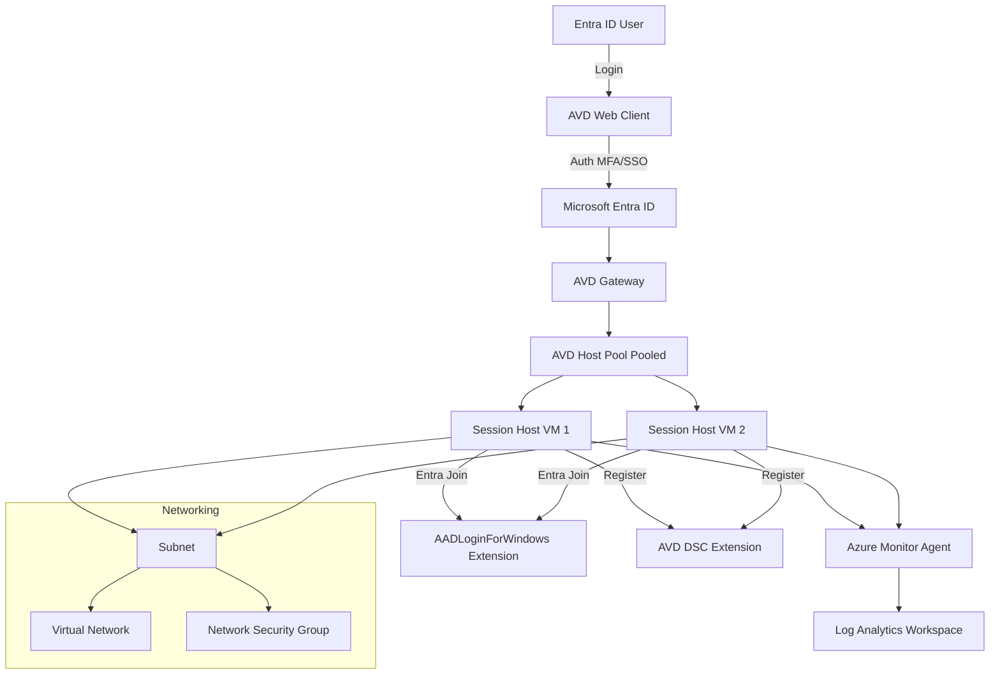

# 🚀 Azure Virtual Desktop (AVD) – Terraform Deployment

## 📌 Overview

In this project, I designed and deployed a **cloud-only Azure Virtual Desktop (AVD) environment using Terraform**, fully integrated with **Microsoft Entra ID (Azure AD)** and without any on-premises dependency.

The goal was to build a **secure, scalable, and production-ready virtual desktop infrastructure**, automated end-to-end using Infrastructure as Code.

---

## 🏗️ Architecture Diagram

---

## ⚙️ What I Implemented

### 🔹 Core Infrastructure

* I created a Resource Group to organize all AVD resources
* I deployed Virtual Network and Subnet for session hosts
* I configured Network Security Group to restrict inbound access

### 🔹 AVD Configuration

* I deployed a **Pooled Host Pool** with Breadth-first load balancing
* I configured Workspace and Application Group for desktop access
* I enabled **Start VM on Connect** for cost optimization

### 🔹 Session Hosts (VMs)

* I provisioned Windows 11 multi-session VMs
* I used **AADLoginForWindows extension** to join VMs to Entra ID
* I used **DSC extension** to register session hosts to Host Pool
* I enabled **Azure Monitor Agent** for diagnostics

### 🔹 Identity & Access

* I integrated **Microsoft Entra ID for authentication**
* I assigned RBAC roles:

  * Desktop Virtualization User
  * Virtual Machine User Login

### 🔹 Monitoring

* I deployed **Log Analytics Workspace**
* I configured diagnostic settings for Host Pool and Workspace

---

## 🔐 Key Features

* Cloud-only AVD deployment (no Active Directory required)
* Entra ID Join (modern authentication)
* No public RDP exposure (secure access via AVD Gateway)
* Automated session host onboarding
* Centralized monitoring with Log Analytics
* Scalable and modular Terraform design

---

## 🔄 End-to-End Flow

1. User logs in via AVD Web Client
2. Authentication handled by Entra ID (MFA/SSO)
3. AVD Gateway securely routes connection
4. Session host VM (Entra joined) provides desktop session

---

## ⚙️ Deployment Details

* **Terraform Version:** >= 1.3.0
* **Providers:**

  * azurerm (~> 3.0)
  * azuread (~> 2.0)

### Default Configuration:

* 2 Session Host VMs
* VM Size: Standard_D4s_v3
* Max sessions per host: 3
* Region: East US

---

## 📤 Outputs

* Host Pool Name & ID
* Workspace ID
* Session Host Names
* AVD Client URL
* Log Analytics Workspace ID

---

## 💼 Project Summary 

* Designed and deployed Azure Virtual Desktop using Terraform in a cloud-only architecture
* Implemented Entra ID-based authentication without on-prem Active Directory
* Configured Host Pool, Workspace, Application Group, and session hosts
* Automated VM onboarding using AADLogin and DSC extensions
* Integrated Azure Monitor and Log Analytics for diagnostics and monitoring
* Built a secure and scalable virtual desktop infrastructure
* 
---

## 🧠 Use Cases

* Remote workforce enablement
* Cloud-first organizations
* Secure VDI without on-prem AD
* Scalable desktop virtualization

---

